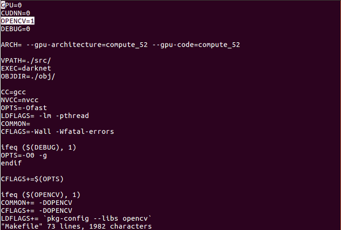

# raspberryPi_Yolo
## 개요 
Yolo를 이용한 PeopleCounting

## 1. 사전준비

#### 1) [라즈베리파이 준비](https://github.com/diqmwl/raspberryPi_OS_Install)

#### 2) [OpenCV 설치](http://blog.xcoda.net/97)
버전은 3.3.0으로 설치했고 링크를 참고 했습니다.

#### 3) Yolo설치 (OpenCV가 설치된 폴더에서 진행합니다)
1. apt update

	```
	[ubuntu ~]$ sudo apt update
	```

2. yolo download

	```
	[ubuntu ~]$ git clone https://github.com/AlexeyAB/darknet
	```
	
	```
	[ubuntu ~]$ cd darknet
	```
저는 라즈베리파이에서는 AlexeyAB버전을 사용해야 오류가 나지않아서 사용했습니다.

3. Makefile 수정

	```
	[ubuntu ~]$ sudo nano Makefile
	```
OPENCV = 0 -> OPENCV = 1 로 수정합니다.




4. build makefile

	```
	[ubuntu ~]$ make
	```
darknet 폴더 내부에서 make를 수행합니다.

5. 가중치 파일 설치

	```
	[ubuntu ~]$ wget https://pjreddie.com/media/files/yolov3-tiny.weights
	```
	
6. 이미지파일 예제 실행

	```
	[ubuntu ~]$ ./darknet detect cfg/yolov3-tiny.cfg yolov3-tiny.weights data/dog.jpg
	```
	
#### 4) Yolo Image.c파일 수정 (예제가 실행되었을경우 진행합니다.)
1. image.c파일 수정

	```
	[ubuntu ~]$ cd src
	```
	
	```
	[ubuntu ~]$ sudo nano image.c
	```

draw_detections_v3함수를 수정합니다. (flag 는 위에 선언했습니다.)


void draw_detections_v3(image im, detection *dets, int num, float thresh, char **names, image **alphabet, int classes, int ext_output)

{
    FILE *f = fopen("/home/pi/people.txt","w");
    fprintf(f,"0");
    fclose(f);
   
    int selected_detections_num;
    detection_with_class* selected_detections = get_actual_detections(dets, num, thresh, &selected_detections_num);
    
    // text output
    qsort(selected_detections, selected_detections_num, sizeof(*selected_detections), compare_by_lefts);
    int i;
    for (i = 0; i < selected_detections_num; ++i) {
        const int best_class = selected_detections[i].best_class;
        if(!strcmp(names[best_class],"person")){flag = flag + 1; }
        if(i == (selected_detections_num)-1){
            FILE *f = fopen("/home/pi/people.txt","w");
            fprintf(f,"%d",flag);
            fclose(f);
            printf("last!!");
        }
        printf("%s: %.0f%% %d ", names[best_class],    selected_detections[i].det.prob[best_class] * 100,flag);
        if (ext_output){
            printf("\t(leftAA_x: %4.0f   top_y: %4.0f   width: %4.0f   height: %4.0f)\n",
                (selected_detections[i].det.bbox.x - selected_detections[i].det.bbox.w / 2)*im.w,
                (selected_detections[i].det.bbox.y - selected_detections[i].det.bbox.h / 2)*im.h,
                selected_detections[i].det.bbox.w*im.w, selected_detections[i].det.bbox.h*im.h);}
        else{
            printf("\n");}
        int j;
        for (j = 0; j < classes; ++j) {
            if (selected_detections[i].det.prob[j] > thresh && j != best_class) {
                printf("%s: %.0f%%\n", names[j], selected_detections[i].det.prob[j] * 100);
            }
        }
    }

   ....
}

이제 이미지에 사람이 검색될경우 person.txt파일에 몇명인지 기록되게 됩니다.
	
	
	```
	[ubuntu ~]$ ./darknet detect cfg/yolov3-tiny.cfg yolov3-tiny.weights data/person.jpg
	```
